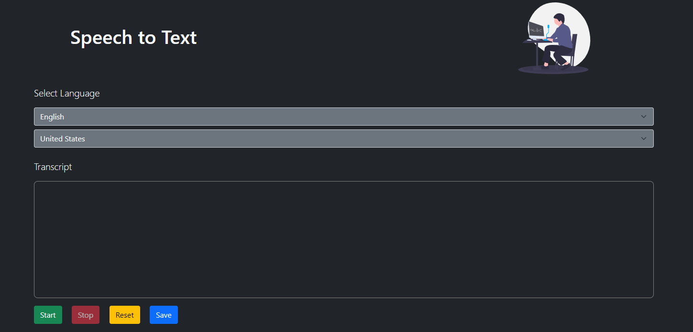

# Speech to Text

A simple web app to convert your voice ideas into typed text using Web Speech API.

See Live [here](https://h4haris.github.io/speech-to-text) 

## Usage

- Select language from a dropdown
- Press `Start` Button to start speaking 
- Press `Stop` Button to stop listening to speech
- Press `Reset` Button to clear text area
- Press `Save` Button to save typed text into a file

### Reference
https://www.section.io/engineering-education/speech-recognition-in-javascript/